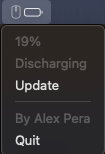

# Razer Mice Battery Check in MacOS Menu Bar

It's 2024 and on MacOS there's no way to check the battery status of Razer' Mice. That's kinda absurd, so here you go.

When it gets under 20% it sends a notification warning of low battery.

## How to install

1. Download app from releases.
2. Move into `/Applications`
3. In System Settings > Login Elements, click on `+` and select `razer-battery-menu-bar.app` to open automatically on login.

If you get warnings because of signature or similar, right-click on it and choose "open"; or in Settings > Privacy & Security scroll down and click "open anyway".